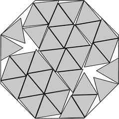

# Polygon Packing Records

A GPU toolkit for finding record packings of unit regular polygons inside minimal
regular containers — the problems catalogued on
[Erich Friedman's Packing Center](https://erich-friedman.github.io/packing/).

During July 4–8, 2026 this toolkit claimed improved packings for **54 problems**
across 14 of the site's tables (triangles/squares/pentagons/hexagons/octagons in
various containers). **52 were credited** under the name *Aristotle Papowitz*
(verified against archived table scrapes), **41 still standing as of
August 16, 2026** — and every submitted packing re-certifies from its exact
coordinates (`paper/certification.csv`). The full reconciled ledger (every
claim, margin, mechanism, and current status) is in [LEDGER.md](LEDGER.md); the
chronological campaign log — what worked, what failed, and every negative
result — is in [CAMPAIGN.md](CAMPAIGN.md).

<p align="center">
  
  <br><em>34 unit triangles in an octagon of side 1.86454+ — found by dropping
  one triangle from a stronger 35-triangle packing and re-squeezing.</em>
</p>

## How records actually fall

Pure multi-start optimization converges to known optima but almost never finds
new ones. Every record this toolkit produced came from one of four *structured*
mechanisms, in descending yield:

1. **Reconstruct + squeeze** (`reconstruct_gif.py`) — recover a competitor's
   coordinates from their published image (~0.1 px accuracy), then converge them
   in float64. Freshly-posted, mass-produced entries are often 1e-4 to 1e-3
   loose; squeezing them below their own displayed floor takes minutes.
2. **Structured basin-hopping** (`packer_bh.py`) — batched L-BFGS waves in
   float32 on GPU with an elite pool, vacancy/teleport/shear moves and lattice
   immigrants, certified on-device in float64. Finds genuinely new arrangements
   the incumbents missed.
3. **Drop-one propagation** (`drop_one.py`) — remove one shape from a strong
   (n+1)-packing and re-squeeze all n+1 removal variants as one batch. When your
   n+1 basin has better architecture than the incumbent's n, the improvement
   cascades downward through consecutive n.
4. **Exact solving** (`exact_solve.py`) — contact graph → independent
   constraints via pivoted QR → min-norm Gauss–Newton in 80–160 digit
   arithmetic → PSLQ. Proves closed forms (or their absence: only trust PSLQ
   relations found at 60+ digits).

## Quickstart

```bash
python -m venv .venv && source .venv/bin/activate
pip install -r polygon-packer/requirements.txt   # JAX with CUDA for GPU search

cd polygon-packer

# Search: 21 triangles (3 sides) in a hexagon (6 sides)
python packer_bh.py 21 3 6 --batch 512 --rounds 40

# Certify a solution: float64 polish + container squeeze + exact margins
python validate_packing.py results/21_3_in_6_bh_top1.json --polish --squeeze

# Reconstruct coordinates from a published packing image
python reconstruct_gif.py image.gif 26 6 5 7.04739 --out recon.json

# Best (n-1)-packing from an n-packing
python drop_one.py recon.json --out-prefix results/25_drop

# Scrape all 24 record tables (and diff against a prior scrape)
python scrape_tables.py ../data/tables-today ../data/tables-yesterday
```

Solution JSONs store the container circumradius, side ratio `s` (the number the
tables list), and per-shape `(x, y, angle)` placements — containers centered at
the origin with a vertex on the +x axis, shapes with circumradius
`1/(2·sin(π/m))` in unit-side units.

## Repository layout

| Path | What it is |
|---|---|
| `polygon-packer/` | The engine and all tools (see table below) |
| `polygon-packer/results/` | Solution JSONs, reconstructions, rendered images |
| `data/tables-*/` | Dated scrapes of all 24 record tables (CSV) |
| `CAMPAIGN.md` | Chronological campaign log: every experiment and verdict |
| `RESEARCH.md` | Survey of methods used by active record setters |
| `TARGETS.md`, `ATTACK.md` | Target selection and attack planning notes |

Key tools in `polygon-packer/`:

| Tool | Purpose |
|---|---|
| `pack_core.py` | Importable engine: penalties, batched L-BFGS, `refine64` (f64 polish/grow/squeeze), solution I/O |
| `packer_bh.py` | Structured basin-hopping CLI (elite pool, kicks, immigrants, seeding, target early-exit) |
| `validate_packing.py` | Exact separating-axis verification with certified dilation bounds |
| `reconstruct_gif.py` | Image → coordinates (color/gray/pastel fills, subpixel boundary fits) |
| `drop_one.py` | n → n−1 by batched removal + squeeze |
| `exact_solve.py` | High-precision contact-system solving + PSLQ closed-form detection |
| `render_webready.py` | Render solutions in the site's exact per-page style (learned from a sample image) |
| `scrape_tables.py` | Scrape + diff the live record tables |

## Practical lessons (the short version)

- **Truncation semantics matter**: a table value `2.90812+` means the incumbent
  holds a value in `[2.90812, 2.90813)`. You have a record only if your
  *certified* value is strictly below the displayed floor.
- **Verify against the live page the same day you submit.** Tables move daily;
  we lost four finished records by sitting on them for thirty hours while a
  competitor swept the same band.
- **Float32 sightings below a plateau are precision artifacts** — nothing is
  real until it survives float64 certification with positive exact margins.
- Negative results are documented in CAMPAIGN.md so you don't have to repeat
  them: the n=9–12 band of all tables is converged; plateau packings
  (`4+4√2`-type) resist rearrangement without shear-permissive moves; drop-one
  across ~400 seeds yielded exactly one (two-record) cascade.

## Credits

- Built on [Flamethr0wer's polygon-packer](https://github.com/Flamethr0wer/polygon-packer)
  (GPL-3.0), heavily extended: JAX GPU batching, float64 certification,
  basin-hopping structure, reconstruction, exact solving, and the campaign
  tooling around it.
- [Erich Friedman](https://erich-friedman.github.io/packing/) maintains the
  Packing Center and processes submissions with remarkable patience.
- The competitors whose relentless pace made this fun: Jonathan Viquerat,
  Bhavithran Ananthan, Jake Loyd, Haowei Lin, Aapo Lipponen, and the FICO
  Xpress team.

## License

GPL-3.0 — see [LICENSE](LICENSE). Inherited from the upstream engine and
applied to the whole toolkit.
